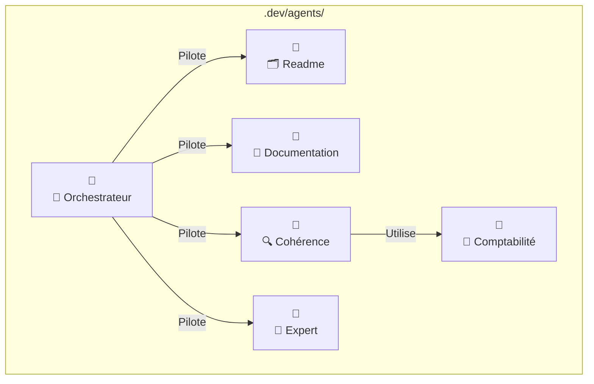
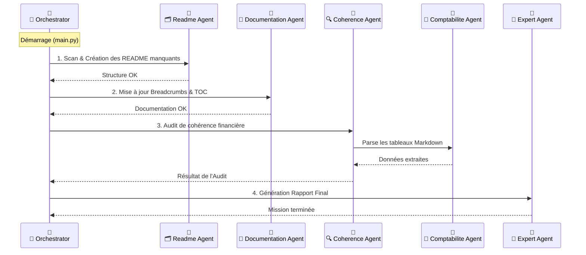

<!-- BREADCRUMB START -->
[🏠](../../README.md) > [📂 Dev](../README.md)
<!-- BREADCRUMB END -->

# 🤖 Agents

Ce dossier contient l'intelligence du projet, répartie en plusieurs agents spécialisés qui collaborent pour maintenir la documentation, vérifier la cohérence financière et générer des rapports d'expertise.

<!-- TOC START --
- [1. Architecture du Système](#1-architecture-du-systeme)
- [2. Flux d'Exécution](#2-flux-dexecution)
- [3. Les Agents et leurs Rôles](#3-les-agents-et-leurs-roles)
  - [3.1. Readme (Librarian)](#31-readme-librarian)
  - [3.2. Documentation (Auto-Updater)](#32-documentation-auto-updater)
  - [3.3. Coherence (Auditor)](#33-coherence-auditor)
  - [3.4. Comptabilite (Comptable)](#34-comptabilite-comptable)
  - [3.5. Expert (DAF)](#35-expert-daf)
  - [3.6. Orchestrator (Chef d'Orchestre)](#36-orchestrator-chef-dorchestre)
<!-- TOC END -->

## 1. Architecture du Système

Voici comment les agents sont organisés structurellement dans le projet :

## 2. Flux d'Exécution

L'ordre de passage est crucial pour garantir une base solide avant les analyses.

## 3. Les Agents et leurs Rôles

| Agent | Dossier | Rôle Principal |
| :--- | :--- | :--- |
| **Readme** | `readme/` | Vérifie l'existence d'un README dans chaque dossier et le crée si nécessaire. |
| **Documentation** | `documentation/` | Injecte automatiquement les fils d'Ariane et les tables des matières dans les fichiers `.md`. |
| **Coherence** | `coherence/` | Compare les données entre différents documents (ex: Seuil vs Prévisionnel) pour détecter les erreurs. |
| **Comptabilite** | `comptabilite/` | Expert en parsing de tableaux Markdown et conversion de devises/chiffres. |
| **Expert** | `expert/` | Interprète les résultats de l'audit pour donner un avis "métier" (type DAF). |
| **Orchestrator** | `orchestrator/` | Coordonne l'ordre d'appel des agents et centralise les logs. |

---

### 3.1. Readme (Librarian)
Assure que le projet reste "explorable" en garantissant une documentation à chaque niveau de dossier.

### 3.2. Documentation (Auto-Updater)
Maintient la navigation fluide (Breadcrumbs) et la structure visuelle (TOC) sans intervention humaine.

### 3.3. Coherence (Auditor)
C'est le garde-fou du projet. Il s'assure que si vous changez un chiffre dans un fichier, il correspond toujours aux autres documents.

### 3.4. Comptabilite (Comptable)
Moteur technique utilisé par l'auditeur pour "lire" les tableaux financiers complexes.

### 3.5. Expert (DAF)
Fournit une vision stratégique suite aux vérifications techniques.

### 3.6. Orchestrator (Chef d'Orchestre)
Le point d'entrée unique (`main.py`) pour lancer toute la machine.

---
> [!TIP]
> Pour les développeurs et les agents IA : consultez le guide **[📜 AGENTS.md](./AGENTS.md)** pour connaître les règles d'or et les conventions du projet.

> [!TIP]
> Pour ajouter un nouvel agent, créez un dossier dans `.dev/agents/`, placez-y un `agent.py` et enregistrez-le dans l'orchestrateur.