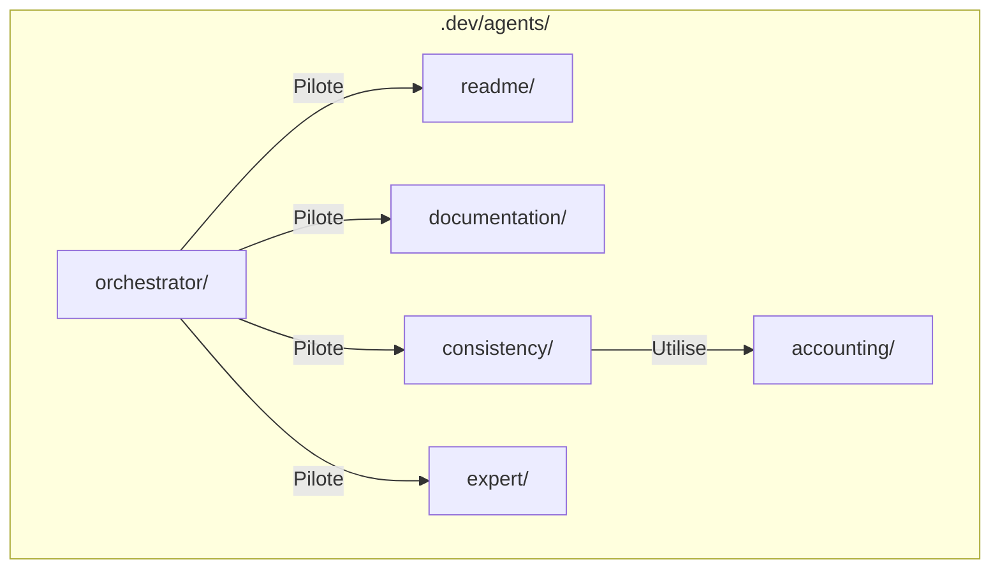
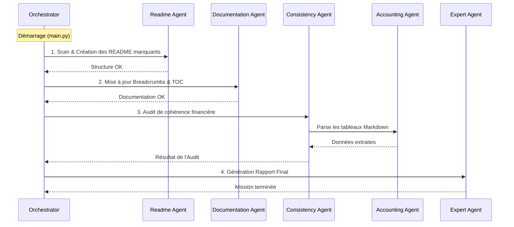

<!-- BREADCRUMB START -->
[🏠](../../README.md) > [📂 .dev](../README.md) > [🤖 Système Multi-Agents ChezSIA](README.md)
<!-- BREADCRUMB END -->

# 🤖 Système Multi-Agents ChezSIA

Ce dossier contient l'intelligence du projet, répartie en plusieurs agents spécialisés qui collaborent pour maintenir la documentation, vérifier la cohérence financière et générer des rapports d'expertise.

<!-- TOC START -->
## 📖 Table des Matières

- [📖 Table des Matières](#table-des-matières)
- [🏗 Architecture du Système](#architecture-du-système)
- [🔄 Flux d'Exécution](#flux-dexécution)
- [👥 Les Agents et leurs Rôles](#les-agents-et-leurs-rôles)
  - [🗂️ Readme (Librarian)](#readme-librarian)
  - [📝 Documentation (Auto-Updater)](#documentation-auto-updater)
  - [🔍 Consistency (Auditor)](#consistency-auditor)
  - [🧮 Accounting (Comptable)](#accounting-comptable)
  - [🎩 Expert (DAF)](#expert-daf)
  - [🎼 Orchestrator (Chef d'Orchestre)](#orchestrator-chef-dorchestre)
<!-- TOC END -->

## 🏗 Architecture du Système

Voici comment les agents sont organisés structurellement dans le projet :

## 🔄 Flux d'Exécution

L'ordre de passage est crucial pour garantir une base solide avant les analyses.

## 👥 Les Agents et leurs Rôles

| Agent | Dossier | Rôle Principal |
| :--- | :--- | :--- |
| **Readme** | `readme/` | Vérifie l'existence d'un README dans chaque dossier et le crée si nécessaire. |
| **Documentation** | `documentation/` | Injecte automatiquement les fils d'Ariane et les tables des matières dans les fichiers `.md`. |
| **Consistency** | `consistency/` | Compare les données entre différents documents (ex: Seuil vs Prévisionnel) pour détecter les erreurs. |
| **Accounting** | `accounting/` | Expert en parsing de tableaux Markdown et conversion de devises/chiffres. |
| **Expert** | `expert/` | Interprète les résultats de l'audit pour donner un avis "métier" (type DAF). |
| **Orchestrator** | `orchestrator/` | Coordonne l'ordre d'appel des agents et centralise les logs. |

---

### 🗂️ Readme (Librarian)
Assure que le projet reste "explorable" en garantissant une documentation à chaque niveau de dossier.

### 📝 Documentation (Auto-Updater)
Maintient la navigation fluide (Breadcrumbs) et la structure visuelle (TOC) sans intervention humaine.

### 🔍 Consistency (Auditor)
C'est le garde-fou du projet. Il s'assure que si vous changez un chiffre dans un fichier, il correspond toujours aux autres documents.

### 🧮 Accounting (Comptable)
Moteur technique utilisé par l'auditeur pour "lire" les tableaux financiers complexes.

### 🎩 Expert (DAF)
Fournit une vision stratégique suite aux vérifications techniques.

### 🎼 Orchestrator (Chef d'Orchestre)
Le point d'entrée unique (`main.py`) pour lancer toute la machine.

---
> [!TIP]
> Pour les développeurs et les agents IA : consultez le guide **[📜 AGENTS.md](./AGENTS.md)** pour connaître les règles d'or et les conventions du projet.

> [!TIP]
> Pour ajouter un nouvel agent, créez un dossier dans `.dev/agents/`, placez-y un `agent.py` et enregistrez-le dans l'orchestrateur.