<!-- BREADCRUMB START -->
[🏠](../../../README.md) > [📂 Dev](../../README.md) > [🤖 Agents](../README.md)
<!-- BREADCRUMB END -->

# 🤖 🔍 Cohérence

Cet agent est le garde-fou du système. Sa mission est de vérifier que les chiffres racontent la même histoire à travers tous les documents du projet.

<!-- TOC START -->
- [1. Scénario et Logique de la Cohérence](#1-scenario-et-logique-de-la-coherence)
  - [1.1. Détail de la logique (Niveau Débutant à Expert)](#11-detail-de-la-logique-niveau-debutant-a-expert)
- [2. Flux et Schémas](#2-flux-et-schemas)
- [3. Commentaires du Code (Lecture Humaine)](#3-commentaires-du-code-lecture-humaine)
<!-- TOC END -->

---

## 1. Scénario et Logique de la Cohérence

L'Agent de Cohérence agit comme un auditeur financier. Il confronte les données de différentes sources (ex: l'Analyse de Rentabilité et le Prévisionnel Financier) pour s'assurer qu'il n'y a pas d'erreurs de saisie ou de calcul.

### 1.1. Détail de la logique (Niveau Débutant à Expert)

1.  **Niveau Débutant :**
    *   Il demande à l'Agent Comptable d'extraire les totaux de deux fichiers différents.
    *   Il compare si les deux nombres sont identiques.

2.  **Niveau Intermédiaire :**
    *   **Gestion des Écarts** : Il accepte une marge d'erreur infime (ex: moins de 5 €) pour ignorer les arrondis mathématiques normaux.
    *   **Rapport de Différence** : Si l'écart est trop grand, il calcule précisément le montant de l'erreur pour aider à la correction.

3.  **Niveau Expert :**
    *   **Logique Métier Avancée** : Il sait que le Prévisionnel doit être comparé à la somme de "Charges fixes cash" + "Amortissements" de la rentabilité. Il ne compare pas juste des chiffres bruts, il applique les règles de la comptabilité analytique.
    *   **Orchestration de Sous-Agent** : Il pilote l'Agent Comptable comme un outil spécialisé, déléguant la complexité du parsing pour se concentrer sur la validation logique.

## 2. Flux et Schémas

```mermaid
sequenceDiagram
    participant O as 🎼 Orchestrateur
    participant C as 🔍 Cohérence
    participant A as 🧮 Comptable
    participant F as 📄 Fichiers (.md)

    O->>C: Lancer Audit (File A, File B)
    C->>A: Parse File A
    A->>F: Lecture Tableaux
    F-->>A: Data
    A-->>C: Totaux A
    C->>A: Parse File B
    A-->>C: Totaux B
    C->>C: Comparaison & Calcul Écart
    C-->>O: Verdict (True/False + Message)
```

## 3. Commentaires du Code (Lecture Humaine)

Voici les intentions pédagogiques extraites directement du script :
- **Tolérance aux arrondis** : Le script utilise `if diff < 5.0` pour éviter de bloquer le système pour quelques centimes d'écart dus aux calculs de TVA ou d'arrondis Excel.
- **Tuilage des Données** : L'agent est programmé pour chercher spécifiquement "Année 1" dans le prévisionnel, assurant qu'il compare des périodes temporelles identiques.
- **Récupération d'Erreur** : Si une clé est manquante dans le tableau (ex: "Poste de Dépense"), l'agent renvoie un message explicatif au lieu de planter.
