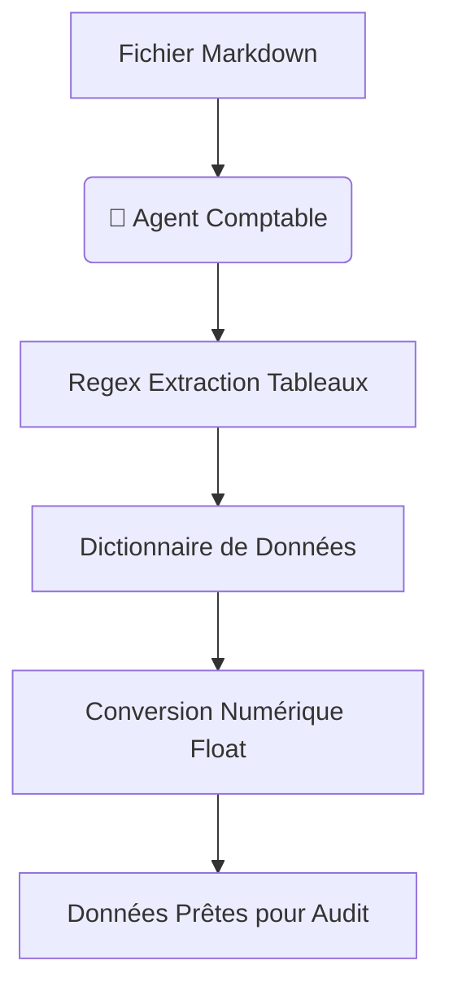

<!-- BREADCRUMB START -->
[🏠](../../../README.md) > [📂 Dev](../../README.md) > [🤖 Agents](../README.md)
<!-- BREADCRUMB END -->

# 🤖 🧮 Comptabilité

Cet agent est le moteur de données du système. Il est spécialisé dans l'extraction et la transformation d'informations structurées contenues dans les fichiers Markdown.

<!-- TOC START -->
- [1. Scénario et Logique du Comptable](#1-scenario-et-logique-du-comptable)
  - [1.1. Détail de la logique (Niveau Débutant à Expert)](#11-detail-de-la-logique-niveau-debutant-a-expert)
- [2. Flux et Schémas](#2-flux-et-schemas)
- [3. Commentaires du Code (Lecture Humaine)](#3-commentaires-du-code-lecture-humaine)
<!-- TOC END -->

---

## 1. Scénario et Logique du Comptable

L'Agent Comptable est un technicien méticuleux. Son rôle est de lire les documents financiers (souvent sous forme de tableaux Markdown complexes) et de les transformer en données exploitables par les autres agents.

### 1.1. Détail de la logique (Niveau Débutant à Expert)

1.  **Niveau Débutant :**
    *   Il ouvre les fichiers `.md`.
    *   Il repère les lignes commençant par `|` pour identifier les tableaux.

2.  **Niveau Intermédiaire :**
    *   **Parsing Adaptatif** : Il extrait les en-têtes (Headers) dynamiquement pour transformer chaque ligne du tableau en dictionnaire Python.
    *   **Nettoyage Monétaire** : Il utilise des expressions régulières pour transformer des chaînes comme `"129 768 €"` en nombres calculables (`129768.0`).

3.  **Niveau Expert :**
    *   **Validation Croisée** : Capable de chercher des valeurs spécifiques (ex: "Résultat exploitation") à travers différents tableaux au sein d'un même fichier.
    *   **Robustesse aux Espaces** : Gère les variations de formatage Markdown (espaces après les pipes, lignes vides entre les tableaux) pour garantir une extraction fiable sans erreurs de type.

## 2. Flux et Schémas

## 3. Commentaires du Code (Lecture Humaine)

Voici les intentions pédagogiques extraites directement du script :
- **Extraction par Regex** : Le script utilise `re.sub(r'[^\d,\.-]', '', ...)` pour être extrêmement permissif sur le formatage monétaire tout en étant strict sur le résultat numérique.
- **Support Multi-Tableaux** : La logique de "reset headers" sur une ligne vide permet à l'agent de traiter plusieurs tableaux différents dans un seul document.
- **Gestion des Headers** : Le premier élément trouvé entre `|` est toujours considéré comme la clé, rendant l'agent flexible face à de nouveaux types de tableaux.
