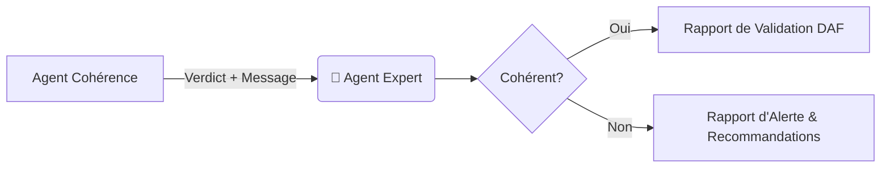

<!-- BREADCRUMB START -->
[🏠](../../../README.md) > [📂 Dev](../../README.md) > [🤖 Agents](../README.md)
<!-- BREADCRUMB END -->

# 🤖 🎩 Expert

Cet agent agit comme un Directeur Administratif et Financier (DAF) virtuel. Il ne manipule pas les chiffres directement, mais interprète les résultats de l'audit pour fournir une vision stratégique.

<!-- TOC START -->
- [1. Scénario et Logique de l'Expert](#1-scenario-et-logique-de-lexpert)
  - [1.1. Détail de la logique (Niveau Débutant à Expert)](#11-detail-de-la-logique-niveau-debutant-a-expert)
- [2. Flux et Schémas](#2-flux-et-schemas)
- [3. Commentaires du Code (Lecture Humaine)](#3-commentaires-du-code-lecture-humaine)
<!-- TOC END -->

---

## 1. Scénario et Logique de l'Expert

L'Expert est l'agent qui a le dernier mot. Il reçoit le verdict technique de l'Agent de Cohérence et le traduit en un rapport professionnel destiné aux décideurs ou aux banquiers.

### 1.1. Détail de la logique (Niveau Débutant à Expert)

1.  **Niveau Débutant :**
    *   Il lit une simple valeur : "Cohérent" ou "Incohérent".
    *   Il choisit le bon modèle de réponse (Vert ou Rouge).

2.  **Niveau Intermédiaire :**
    *   **Contextualisation** : Il ne se contente pas de dire "OK", il explique pourquoi (alignement des charges fixes).
    *   **Recommandation métier** : Il donne un conseil pratique (ex: "Le dossier est prêt pour la banque").

3.  **Niveau Expert :**
    *   **Analyse de l'écart** : En cas d'erreur, il identifie les causes probables (oubli d'amortissement, double comptage) pour guider le développeur ou le comptable.
    *   **Indépendance** : Il est conçu pour être découplé de la méthode de calcul, ce qui permet de changer l'algorithme de cohérence sans impacter la structure du rapport final.

## 2. Flux et Schémas

## 3. Commentaires du Code (Lecture Humaine)

Voici les intentions pédagogiques extraites directement du script :
- **Clarté du rapport** : Utilise des séparateurs visuels (`---`) et des emojis pour rendre le rapport immédiat à lire dans un terminal.
- **Gestion des cas d'erreur** : Le script prévoit des messages d'alerte spécifiques pour les erreurs courantes (amortissements, charges cash).
- **Extensibilité** : La méthode `generate_report` prend un tuple, ce qui facilite l'ajout de nouvelles métriques d'audit à l'avenir.
