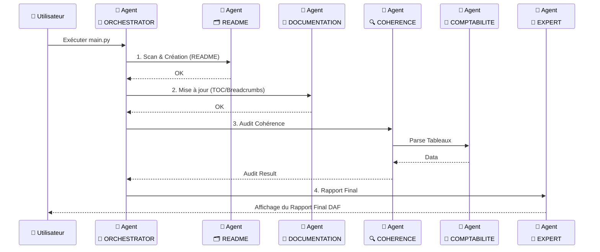

<!-- BREADCRUMB START -->
[🏠](../../../README.md) > [📂 Dev](../../README.md) > [🤖 Agents](../README.md)
<!-- BREADCRUMB END -->

# 🤖 🎼 Orchestrator

C'est le point d'entrée du système multi-agents. Il coordonne l'exécution séquentielle de tous les agents pour produire un audit complet.

<!-- TOC START --
- [1. Scénario et Logique de l'Orchestrateur](#1-scenario-et-logique-de-lorchestrateur)
  - [1.1. Détail de la logique (Niveau Débutant à Expert)](#11-detail-de-la-logique-niveau-debutant-a-expert)
- [2. Flux et Schémas du Système Complet](#2-flux-et-schemas-du-systeme-complet)
- [3. Commentaires du Code (Lecture Humaine)](#3-commentaires-du-code-lecture-humaine)
<!-- TOC END -->

## 1. Scénario et Logique de l'Orchestrateur

L'Orchestrateur est le chef d'orchestre. Il s'assure que chaque agent entre en scène au bon moment et possède les partitions (données) nécessaires pour jouer sa partie.

### 1.1. Détail de la logique (Niveau Débutant à Expert)

1.  **Niveau Débutant :**
    *   C'est le bouton "START".
    *   Il appelle d'abord les agents qui nettoient et rangent (Readme & Doc).
    *   Puis il appelle les agents qui calculent (Cohérence).
    *   Enfin, il demande à l'expert de donner son avis.

2.  **Niveau Intermédiaire :**
    *   **Gestion des Chemins :** Il calcule dynamiquement la racine du projet (`project_root`) pour que les agents puissent trouver les fichiers [`[Documents/](../../../Documents/README.md)`](../../../Documents/README.md) peu importe d'où le script est lancé.
    *   **Chaînage de Dépendance :** Il réalise que l'Agent Expert a besoin du résultat de l'Agent de Cohérence, il fait donc le pont entre les deux.

3.  **Niveau Expert :**
    *   **Configuration du `sys.path` :** Modifie dynamiquement l'environnement Python pour permettre l'importation de modules situés dans des dossiers frères sans avoir besoin d'installer le projet comme un package.
    *   **Cycle de Vie (Pipeline) :**
        1.  **Phase de Préparation :** Maintenance de la documentation (agents passifs).
        2.  **Phase d'Exécution :** Audit financier (agents actifs).
        3.  **Phase de Reporting :** Synthèse DAF.
    *   **Robustesse :** Inclut des vérifications d'existence de fichiers avant de lancer les agents gourmands en ressources, évitant des erreurs en cascade.

## 2. Flux et Schémas du Système Complet

## 3. Commentaires du Code (Lecture Humaine)

Voici les intentions pédagogiques extraites directement du script :
- **Calcul du Root** : Utilise `parent.parent` pour remonter de `.dev/agents/orchestrator` vers la racine du projet en toute sécurité.
- **Imports Relatifs** : La structure d'import permet de maintenir les agents totalement indépendants les uns des autres (découplage).
- **Fallback Feedback** : Si les fichiers financiers sont manquants, le script affiche un message d'erreur explicatif plutôt que de planter silencieusement.
