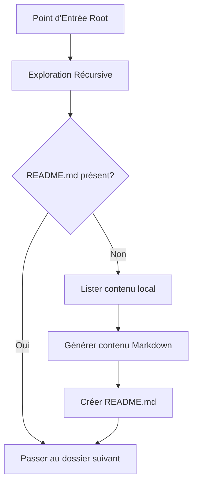

<!-- BREADCRUMB START -->
[🏠](../../../README.md) > [📂 Dev](../../README.md) > [🤖 Agents](../README.md)
<!-- BREADCRUMB END -->

# 🤖 🗂️ Readme

Cet agent est le bibliothécaire du projet. Sa mission est de garantir que chaque recoin du dépôt est documenté et facilement explorable pour les nouveaux arrivants ou les IA.

<!-- TOC START -->
## 📖 Table des Matières

- [📖 Table des Matières](#table-des-matières)
- [🧠 Scénario et Logique du Readme](#scénario-et-logique-du-readme)
  - [🔍 Détail de la logique (Niveau Débutant à Expert)](#détail-de-la-logique-niveau-débutant-à-expert)
- [📊 Flux et Schémas](#flux-et-schémas)
- [💬 Commentaires du Code (Lecture Humaine)](#commentaires-du-code-lecture-humaine)
<!-- TOC END -->

---

## 🧠 Scénario et Logique du Readme

L'Agent Readme ne dort jamais. Il parcourt récursivement tous les dossiers du projet et, s'il découvre un dossier "nu" (sans fichier README.md), il en génère un automatiquement avec une structure standard.

### 🔍 Détail de la logique (Niveau Débutant à Expert)

1.  **Niveau Débutant :**
    *   Il entre dans chaque dossier.
    *   Il vérifie la présence d'un fichier nommé `README.md`.

2.  **Niveau Intermédiaire :**
    *   **Template Dynamique** : S'il doit créer un fichier, il liste automatiquement tous les fichiers et sous-dossiers présents pour créer une table des matières locale instantanée.
    *   **Distinction de Types** : Il fait la différence visuelle entre un fichier (📄) et un dossier (📁) dans les liens générés.

3.  **Niveau Expert :**
    *   **Filtrage Système** : Il sait ignorer les dossiers techniques (`.git`, `__pycache__`, `.vscode`) pour ne pas polluer les environnements de développement.
    *   **Auto-Étiquetage** : Il ajoute une mention spécifiant que le document a été généré par un agent, encourageant ainsi l'humain à venir l'enrichir par la suite.

## 📊 Flux et Schémas

## 💬 Commentaires du Code (Lecture Humaine)
 
Voici les intentions pédagogiques extraites directement du script :
- **Utilisation d'os.walk** : Utilise la méthode standard de Python pour un parcours d'arbre efficace, en modifiant la liste de recherche in-place pour ignorer les dossiers système.
- **Formatage de Tableau** : Génère systématiquement un tableau Markdown pour la liste des fichiers, ce qui garantit une lisibilité maximale même si le dossier contient beaucoup d'éléments.
- **Alertes GitHub** : Utilise le format `> [!NOTE]` pour créer des blocs visuels modernes dans l'interface de GitHub ou des lecteurs Markdown.
